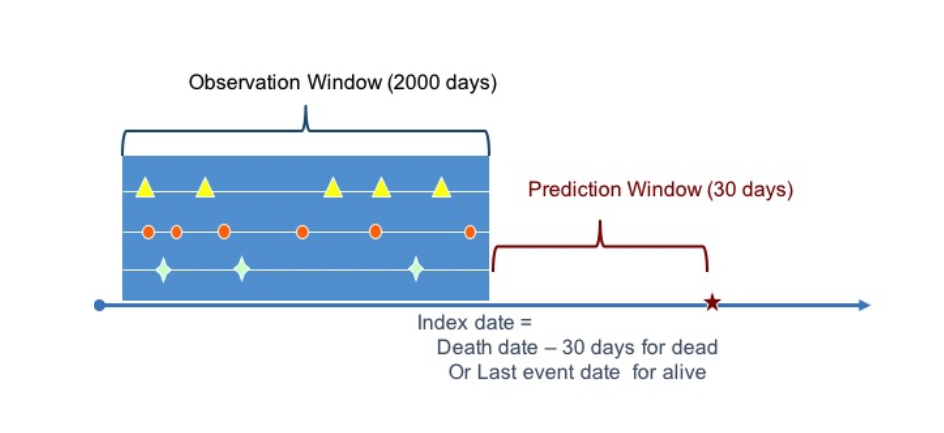

# ML Pipeline for Predicting Mortality Rate

## Overview
We will build an ML pipeline to predict the mortality of a patient given their clinical history. This may include their diagnosis, medication, and lab results. This is a retrospective records-based study on patients from their past electronic health records (EHRs) for a specific pre-determined observation window. Care has been taken to remove all personal identifiable information (PII) and/or protected health information (PHI) in compliance with HIPAA research-related rules has been de-identified. 

## Data

### Cohort Construction
The cohort in this study contains cases of deceased patients and a control for case-control study. In the training data, the the cases and controls are balanced at a 1:1 ratio to allow for balanced class model training. The test data will however be unlabeled. 

We will be using the following datasets found in the `/data` folder which are further divided between the training and test data set:

`/train`
- `event_feature_map.csv`
- `events.csv`
- `mortality_events.csv`

`/test`
- `event_feature_map.csv`
- `events.csv`

### `events.csv`
- `'patient_id'`
- `'event_id'`
- `'event_description'`
- `'timestamp'`
- `'value'`

This dataset describes the clinical events `['event_id']` that have occurred for each respective patient `['patient_id']` and the date `[timestamp']` of when the event occurred. There is additional meta information in `['event_description']` describing the respective event. There will be `740,066` labeled records in the training dataset and `488,347` unlabeled records in the test dataset. 

### `event_feature_map.csv`
- `'idx'`
- `'event_id'`
This csv file is for feature mapping the events that have occurred in `events.csv` to a respective `['idx']` as a feature label during the model training process. This is to optimize the model training time given that this will be a sparse matrix (i.e. most patients will only have a small subset of all the possible events occurring).

### `mortality_events.csv`
- `'patient_id'`
- `'timestamp'`
- `'label'`
This spreadsheet indicates the date `['timestamp']` of death for each patient `['patient_id']` and the label is set at the value of `1` by default to indicate it is a positive label. We will assume all patients that are in `events_csv` but not in `mortality_events.csv` to be alive and will have a label of `0` during the ETL process. This is also the predictor variable for this pipeline, where we are trying to determine the probability of death given the events that have occurred. 

## Feature Construction

The goal of this is to construct all potentially relevant features about patients in order to predict the target outcome. The diagnosis date for the target outcome (deceased patients) is reflected in the `mortality_events.csv` for the respective patient. Before the diagnosis date, we have a prediction window of 30 days where the index date is on day 0 of the prediction window. We will have an observation window of 2000 days prior to the index date. We use all patient information during the observation window to construct features. We will also count the number of times each event occurs for a particular patient for diagnosis and drug consumption events. We will use the respective lab results for each patient as a feature. The length of the prediction window and observation window are two important paramters that will impact the model performance.  

## Predictive Modeling
As the target outcome is to predict whether a patient will be deceased within the prediction window, this is a binary classification problem. 

## Model Validation
The model will be validated using a K-Fold cross-validation found in `/src/cross.py`

## Final Output
The final output will be an exported csv file found in `/deliverables/my_prediction.csv` where the labels may be a soft or hard label (binary or continuous value between 0 and 1) depending on the script in `/src/my_model.py`

The classifier will be tested on the test data at `/deliverables/test_features.txt` that was generated in the script. 

All of this can be self-contained when running the the command `python my_model.py` in the `/src` folder.